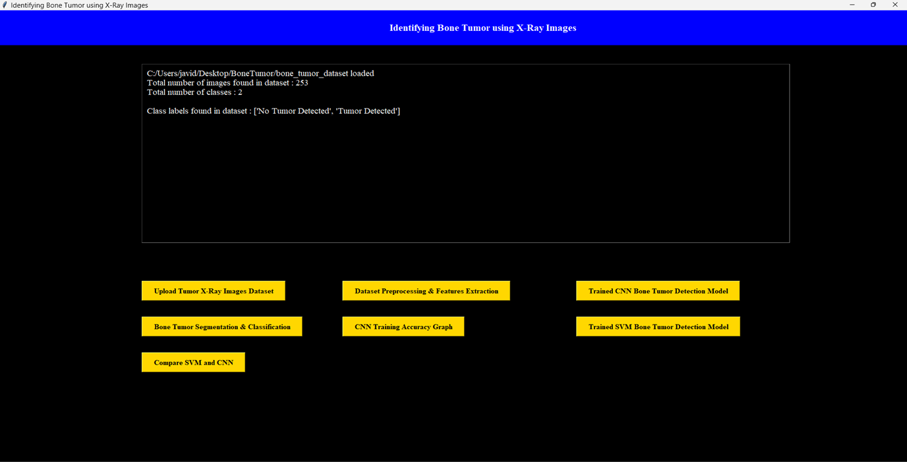

# IDENTIFYING BONE TUMOR USING X-RAY IMAGES

### Presented By
- SHAIK SHAHRAJ BEE                   : 	    208X1A0594
- SHAIK MASTHAN JAVID VALI            :         208X1A0591
- JAMPANI SRAVANTHI                   :         218X5A0510
- NELAPATI MANOJ KUMAR                :         208X1A05C1

### Under the Guidance of
- MRS. P. LAVANYA M.TECH  (ASST. PROFESSOR)

## IDENTIFYING BONE TUMOR USING X-RAY IMAGES
<table>
    <tr>
        <td></td>
        <td></td>
    </tr>
<table>

### CONTENTS
- ABSTRACT
- INTRODUCTION
- HARDWARE REQUIREMENTS
- SOFTWARE REQUIREMENTS
- EXISTING SYSTEM
- PROPOSED SYSTEM
- METHODOLOGY
- TECHNOLOGIES USED
- FINAL RESULT
- ADVANTAGES
- CONCLUSION

### ABSTRACT
- Utilize Convolution Neural Networks (CNNs) and X-Ray images to accurately identify and classify bone tumour.
- By training the CNN algorithm with a dataset containing tumour and non-tumour images.
- Our goal is to develop a robust system.
- That can effectively differentiate between normal bone structure and those exhibiting signs of tumours.

### INTRODUCTION
- X-ray image analysis provides one of the cheapest primary screening tools for the diagnosis of bone cancer.
- The X-ray absorption rate of bone cells in the cancer- affected region differs from that in healthy bone cells.
- As a result, the image of cancer-affected bones appears in the form of a “ragged” surface.
- Progressive identification of destruction pattern in a cancer-affected bone also helps doctors to estimate the rapidity of growth of the disease, or prognosis of the treatment. 

### HARDWARE REQUIREMENTS 

<table>
    <tr>
        <td> Processor : PENTIUM III</td>
        <td> Hard Disk
    </tr>
    <tr>
        <td></td>
        <td></td>
    </tr>
</table>

### SOFTWARE REQUIREMENTS
- TensorFlow
- Keras - A deep learning library
- OpenCV - Python module

### EXISTING SYSTEM
- X-ray analysis serves as a cost-effective primary screening tool for diagnosing bone cancer.
- FAULTS
    1. Low Accuracy  
    2. Potential Health Risks
    3. Tissue Effects
    4. Limited Detection Capability

### PROPOSED SYSTEM
- Researchers used more than 600 cases to train the deep learning model and then 140 cases to validate and test it.
- The model achieved 80% accuracy and 88% specificity in the classification of bone tumors as malignant or benign.
- ADVANTAGES
    1. High Accuracy in Classification
    2. Supports Treatment Planning
    3. Expert-Level Performance
    4. Noninvasive and Painless Diagnosis  

### DATA PROCESSING METHODS

1. DATASET UPLOAD             
2. DATASET PREPROCESSING 
3. FEATURES EXTRACTION
4. SEGMENTATION 
5. CLASSIFICATION

###  CONVOLUTION NEURAL NETWORK(CNN)
- In layers of CNN, the neurons are arranged in 3 dimensions: width, height, depth.
- Useful for finding patterns in images to recognize objects, classes, and categories. 
- CNNs process input data, often images, by applying a series of convolutional and pooling layers. 
- Convolutional layers employ small filters to convolve across the input, detecting spatial patterns.

### CNN DIAGRAM

### USAGE OF CNN IN BONE TUMOR 

### TECHNOLOGIES USED
- TENSORFLOW:
    - TensorFlow is an open-source software library for numerical computation and large-scale machine learning. 
    - It offers powerful functionalities for building and deploying models, making it a popular choice for various deep learning tasks.
- KERAS:
    - Keras is a high-level API for building and training deep learning models, written in Python. 
    - Keras makes it easier to experiment with different architectures and configurations, reducing boilerplate code and simplifying the deep learning process.
- OPENCV:
    - OpenCV, an open-source computer vision and machine learning library.
    - Stands as a cornerstone in the field of computer vision. 
    - Its primary focus is on providing a comprehensive set of tools and algorithms for image and video processing.
    - Enabling tasks such as object detection, facial recognition, gesture analysis, and more. 

### FINAL RESULT
> OUTPUT INTERFACE

> UPLOADING DATASET

> TRAINING CNN MODEL

> INPUT IMAGE 

> TUMOR RECONGITION

> CNN TRAINING ACCURACY GRAPH

### ADVANTAGES
- EARLY DETECTION
- NON-INVASIVE
- COST-EFFECTIVE
- WIDESPREAD AVAILABILITY
- QUICK IMAGING PROCESS
- HIGH RESOLUTION
- INTEGRATION WITH COMPUTER-AIDED DIAGNOSIS (CAD)
- LONGITUDINAL MONITORING
- MINIMAL RADIATION EXPOSURE

### CONCLUSION
- In Conclusion The Implementation Of convolutional Neural Networks (CNNs) For Bone Tumor Identifying Using X-ray Image Shows Promising Result.
- By Preprocessing the Dataset Extracting Relevant Feature, And Applying Segmentation And Tumor.
- This System Has The Potential To Assist Medical Professionals In Timely And Accurate Diagnosis, Improving Patient Outcomes.

### How to Execute

> [!NOTE] 
> Install Python 3.8.5 - Goto https://www.python.org/downloads/release/python-385/ - click on Windows x86-64 executable installer 
> Make sure to add python 3.8.5 to path.
> 
> Clone/Download this Repository and Extract it to the Desktop 
> Open this folder click on run.bat file - it will installs all packages that will be needed.
> And then it shows the output😉
